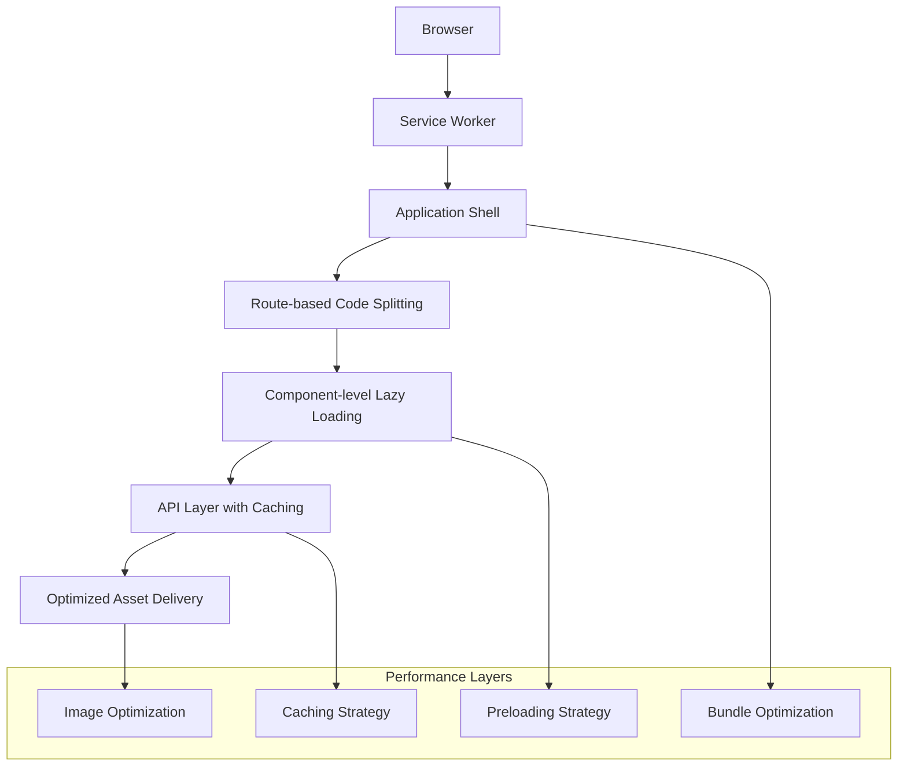

# Performance Optimization Design Document

## Overview

This design document outlines a comprehensive performance optimization strategy for the Nepean Mortgage React application. The optimization focuses on reducing bundle sizes, improving load times, implementing efficient caching strategies, and enhancing the overall user experience through modern web performance techniques.

## Architecture

### Current State Analysis

Based on the codebase analysis, the application currently has:

- React 19 with TypeScript and Vite build system
- Lazy loading implemented for some components (About, OurProcess, etc.)
- Basic API context with localStorage caching
- Multiple calculator modals using iframes
- Standard component structure without advanced optimizations

### Proposed Architecture Improvements



## Components and Interfaces

### 1. Bundle Optimization System

**Interface: BundleOptimizer**

```typescript
interface BundleOptimizationConfig {
  chunkSizeLimit: number;
  preloadThreshold: number;
  criticalChunks: string[];
}

interface ChunkAnalysis {
  size: number;
  dependencies: string[];
  loadPriority: "critical" | "high" | "normal" | "low";
}
```

**Responsibilities:**

- Implement advanced code splitting strategies
- Optimize vendor chunk splitting
- Configure dynamic imports with prefetching
- Implement bundle analysis and monitoring

### 2. Asset Optimization System

**Interface: AssetOptimizer**

```typescript
interface ImageOptimizationConfig {
  formats: ("webp" | "avif" | "jpeg" | "png")[];
  sizes: number[];
  quality: number;
  lazyLoadThreshold: number;
}

interface AssetManifest {
  images: OptimizedImageSet[];
  fonts: FontLoadingStrategy[];
  icons: IconOptimizationConfig;
}
```

**Responsibilities:**

- Generate responsive image sets
- Implement modern image format delivery
- Optimize font loading strategies
- Manage icon and SVG optimization

### 3. Enhanced Caching System

**Interface: CacheManager**

```typescript
interface CacheStrategy {
  apiCache: {
    ttl: number;
    maxSize: number;
    strategy: "stale-while-revalidate" | "cache-first" | "network-first";
  };
  assetCache: {
    staticAssets: CacheConfig;
    dynamicContent: CacheConfig;
  };
  routeCache: {
    preloadRoutes: string[];
    cacheStrategy: RoutesCacheStrategy;
  };
}
```

**Responsibilities:**

- Implement intelligent API response caching
- Manage browser cache strategies
- Handle offline functionality
- Implement cache invalidation strategies

### 4. Performance Monitoring System

**Interface: PerformanceMonitor**

```typescript
interface PerformanceMetrics {
  coreWebVitals: {
    fcp: number;
    lcp: number;
    cls: number;
    fid: number;
  };
  customMetrics: {
    apiResponseTime: number;
    componentLoadTime: number;
    routeTransitionTime: number;
  };
}

interface PerformanceThresholds {
  fcp: number;
  lcp: number;
  bundleSize: number;
  apiResponseTime: number;
}
```

**Responsibilities:**

- Monitor Core Web Vitals
- Track custom performance metrics
- Implement performance budgets
- Generate performance reports

## Data Models

### 1. Optimized Component Loading

```typescript
interface ComponentLoadingStrategy {
  component: string;
  loadingStrategy: "eager" | "lazy" | "preload" | "prefetch";
  priority: number;
  dependencies: string[];
  preloadConditions?: PreloadCondition[];
}

interface PreloadCondition {
  type: "route" | "interaction" | "viewport" | "idle";
  trigger: string;
  delay?: number;
}
```

### 2. Enhanced API Caching Model

```typescript
interface CachedApiResponse<T> {
  data: T;
  timestamp: number;
  ttl: number;
  etag?: string;
  version: string;
  compressionType?: "gzip" | "brotli";
}

interface ApiCacheEntry {
  key: string;
  response: CachedApiResponse<any>;
  accessCount: number;
  lastAccessed: number;
  priority: "high" | "medium" | "low";
}
```

### 3. Resource Optimization Configuration

```typescript
interface ResourceOptimizationConfig {
  images: {
    formats: ImageFormat[];
    breakpoints: number[];
    quality: QualitySettings;
    lazyLoading: LazyLoadingConfig;
  };
  fonts: {
    preloadFonts: string[];
    fontDisplay: "swap" | "fallback" | "optional";
    subsetStrategy: FontSubsetConfig;
  };
  scripts: {
    criticalScripts: string[];
    deferredScripts: string[];
    modulePreload: string[];
  };
}
```

## Error Handling

### 1. Performance Degradation Handling

**Graceful Degradation Strategy:**

- Implement fallback loading strategies for slow connections
- Provide simplified UI modes for low-performance devices
- Handle chunk loading failures with retry mechanisms
- Implement timeout handling for API requests

**Error Recovery Mechanisms:**

```typescript
interface PerformanceErrorHandler {
  handleChunkLoadError(chunkId: string): Promise<void>;
  handleApiTimeout(endpoint: string): Promise<any>;
  handleImageLoadFailure(src: string): string; // Returns fallback URL
  handleFontLoadFailure(fontFamily: string): void;
}
```

### 2. Cache Error Handling

**Cache Invalidation and Recovery:**

- Implement cache corruption detection
- Handle storage quota exceeded errors
- Provide cache clearing mechanisms
- Implement cache versioning for updates

## Testing Strategy

### 1. Performance Testing

**Automated Performance Tests:**

- Lighthouse CI integration for Core Web Vitals monitoring
- Bundle size regression testing
- API response time monitoring
- Memory usage profiling

**Test Scenarios:**

```typescript
interface PerformanceTestSuite {
  bundleAnalysis: {
    maxBundleSize: number;
    chunkSizeDistribution: ChunkSizeTest[];
    duplicateCodeDetection: boolean;
  };
  loadingPerformance: {
    firstContentfulPaint: number;
    largestContentfulPaint: number;
    timeToInteractive: number;
  };
  runtimePerformance: {
    componentRenderTime: ComponentRenderTest[];
    memoryLeakDetection: boolean;
    apiResponseCaching: CacheEfficiencyTest[];
  };
}
```

### 2. Cross-Device Testing

**Device Performance Validation:**

- Test on various device capabilities (CPU, memory, network)
- Validate performance on different browsers
- Test offline functionality
- Validate touch interaction responsiveness

### 3. Caching Strategy Testing

**Cache Effectiveness Tests:**

- Cache hit rate monitoring
- Cache invalidation testing
- Offline functionality validation
- Storage quota management testing

## Implementation Phases

### Phase 1: Bundle Optimization

- Implement advanced code splitting
- Optimize vendor chunk configuration
- Add bundle analysis tooling
- Configure preloading strategies

### Phase 2: Asset Optimization

- Implement responsive image generation
- Add modern image format support
- Optimize font loading strategies
- Implement lazy loading improvements

### Phase 3: Enhanced Caching

- Upgrade API caching system
- Implement service worker for asset caching
- Add offline functionality
- Implement cache invalidation strategies

### Phase 4: Performance Monitoring

- Add Core Web Vitals monitoring
- Implement performance budgets
- Add custom performance metrics
- Create performance dashboards

## Technology Stack Integration

### Vite Configuration Enhancements

- Advanced chunk splitting configuration
- Asset optimization plugins
- Bundle analysis integration
- Development performance tooling

### React Optimizations

- Enhanced lazy loading with Suspense
- Component memoization strategies
- Context optimization
- Event handler optimization

### Browser API Utilization

- Intersection Observer for lazy loading
- Performance Observer for metrics
- Service Worker for caching
- Web Workers for heavy computations
