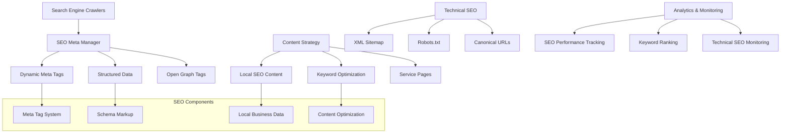

# SEO Optimization Design Document

## Overview

This design document outlines a comprehensive SEO optimization strategy for the Nepean Mortgage website. The optimization builds upon the existing react-helmet-async implementation to provide technical SEO, content optimization, local SEO, and structured data markup to improve search engine visibility and organic traffic.

## Architecture

### Current SEO State Analysis

Based on the codebase analysis, the application currently has:

- React Helmet Async for dynamic meta tag management
- Basic title management in LandingPage.tsx
- Single-page application with client-side routing
- No structured data or local business markup
- Limited meta descriptions and SEO optimization

### Proposed SEO Architecture



## Components and Interfaces

### 1. SEO Meta Management System

**Interface: SEOMetaManager**

```typescript
interface SEOPageData {
  title: string;
  description: string;
  keywords: string[];
  canonicalUrl: string;
  ogImage?: string;
  ogType?: "website" | "article" | "business.business";
  structuredData?: StructuredDataObject[];
}

interface SEOConfig {
  siteName: string;
  defaultTitle: string;
  titleTemplate: string;
  defaultDescription: string;
  defaultKeywords: string[];
  businessInfo: LocalBusinessInfo;
  socialMedia: SocialMediaLinks;
}
```

**Responsibilities:**

- Manage dynamic meta tags for all pages
- Generate Open Graph and Twitter Card tags
- Handle canonical URL management
- Implement title templates and fallbacks

### 2. Structured Data System

**Interface: StructuredDataManager**

```typescript
interface LocalBusinessSchema {
  "@context": "https://schema.org";
  "@type": "FinancialService" | "LocalBusiness";
  name: string;
  description: string;
  address: PostalAddress;
  telephone: string;
  email: string;
  url: string;
  openingHours: string[];
  serviceArea: GeoCircle;
  hasOfferCatalog: OfferCatalog;
}

interface ServiceSchema {
  "@context": "https://schema.org";
  "@type": "Service";
  name: string;
  description: string;
  provider: Organization;
  serviceType: string;
  areaServed: string[];
}

interface FAQSchema {
  "@context": "https://schema.org";
  "@type": "FAQPage";
  mainEntity: Question[];
}
```

**Responsibilities:**

- Generate JSON-LD structured data for business information
- Create service-specific schema markup
- Implement FAQ schema for better search visibility
- Handle breadcrumb and navigation schema

### 3. Content Optimization System

**Interface: ContentOptimizer**

```typescript
interface ContentSEOData {
  headings: HeadingStructure[];
  keywords: KeywordDensity[];
  internalLinks: InternalLink[];
  images: ImageSEOData[];
  readabilityScore: number;
}

interface KeywordStrategy {
  primary: string[];
  secondary: string[];
  longTail: string[];
  local: string[];
  semantic: string[];
}

interface LocalSEOContent {
  locationPages: LocationPageData[];
  serviceAreas: ServiceArea[];
  localKeywords: LocalKeyword[];
  businessCitations: Citation[];
}
```

**Responsibilities:**

- Optimize content for target keywords
- Manage heading hierarchy and structure
- Implement internal linking strategies
- Handle image SEO optimization

### 4. Technical SEO System

**Interface: TechnicalSEOManager**

```typescript
interface SitemapConfig {
  pages: SitemapPage[];
  changeFrequency:
    | "always"
    | "hourly"
    | "daily"
    | "weekly"
    | "monthly"
    | "yearly"
    | "never";
  priority: number;
  lastModified: Date;
}

interface RobotsConfig {
  userAgent: string;
  allow: string[];
  disallow: string[];
  sitemap: string[];
  crawlDelay?: number;
}

interface CanonicalURLStrategy {
  baseURL: string;
  trailingSlash: boolean;
  parameterHandling: "ignore" | "include" | "canonical";
}
```

**Responsibilities:**

- Generate and maintain XML sitemaps
- Manage robots.txt configuration
- Handle canonical URL implementation
- Implement meta robots directives

## Data Models

### 1. SEO Page Configuration

```typescript
interface SEOPageConfig {
  route: string;
  title: string;
  description: string;
  keywords: string[];
  h1: string;
  contentType:
    | "homepage"
    | "service"
    | "about"
    | "contact"
    | "faq"
    | "calculator";
  localRelevance: boolean;
  structuredDataTypes: StructuredDataType[];
  openGraph: OpenGraphData;
  priority: number;
}

interface OpenGraphData {
  title: string;
  description: string;
  image: string;
  type: string;
  url: string;
  siteName: string;
  locale: string;
}
```

### 2. Local Business Information

```typescript
interface LocalBusinessData {
  name: string;
  legalName: string;
  description: string;
  address: {
    streetAddress: string;
    addressLocality: string;
    addressRegion: string;
    postalCode: string;
    addressCountry: string;
  };
  contactInfo: {
    telephone: string;
    email: string;
    website: string;
  };
  businessHours: OpeningHours[];
  serviceAreas: string[];
  services: BusinessService[];
  socialProfiles: string[];
}

interface BusinessService {
  name: string;
  description: string;
  serviceType: string;
  provider: string;
  areaServed: string[];
  keywords: string[];
}
```

### 3. Content SEO Metadata

```typescript
interface ContentSEOMetadata {
  wordCount: number;
  readingTime: number;
  keywordDensity: KeywordDensityMap;
  headingStructure: HeadingHierarchy;
  internalLinks: InternalLinkData[];
  externalLinks: ExternalLinkData[];
  images: ImageSEOMetadata[];
  lastUpdated: Date;
}

interface ImageSEOMetadata {
  src: string;
  alt: string;
  title?: string;
  caption?: string;
  width: number;
  height: number;
  format: string;
  fileSize: number;
}
```

## Error Handling

### 1. SEO Fallback Strategies

**Meta Tag Fallbacks:**

- Implement default meta tags when dynamic content fails
- Handle missing API data gracefully
- Provide fallback descriptions and titles
- Ensure canonical URLs always resolve

**Structured Data Error Handling:**

```typescript
interface SEOErrorHandler {
  handleMissingBusinessData(): LocalBusinessSchema;
  handleInvalidStructuredData(data: any): StructuredDataObject | null;
  handleCanonicalURLError(route: string): string;
  handleSitemapGenerationError(): SitemapPage[];
}
```

### 2. Content Optimization Error Recovery

**Content Validation:**

- Validate heading hierarchy and fix automatically
- Handle missing alt text with descriptive fallbacks
- Ensure minimum content length requirements
- Validate internal link integrity

## Testing Strategy

### 1. SEO Technical Testing

**Automated SEO Tests:**

- Meta tag presence and format validation
- Structured data schema validation
- Sitemap generation and format testing
- Canonical URL correctness testing

**Test Scenarios:**

```typescript
interface SEOTestSuite {
  metaTags: {
    titleLength: { min: number; max: number };
    descriptionLength: { min: number; max: number };
    keywordRelevance: boolean;
  };
  structuredData: {
    schemaValidation: boolean;
    businessInfoCompleteness: boolean;
    serviceSchemaAccuracy: boolean;
  };
  technicalSEO: {
    sitemapValidation: boolean;
    robotsTxtValidation: boolean;
    canonicalURLs: boolean;
    mobileResponsiveness: boolean;
  };
}
```

### 2. Content SEO Testing

**Content Quality Validation:**

- Keyword density optimization testing
- Heading hierarchy validation
- Internal linking structure testing
- Image SEO compliance testing

### 3. Local SEO Testing

**Local Business Validation:**

- Business information consistency testing
- Local keyword optimization validation
- Service area coverage testing
- Citation accuracy verification

## Implementation Strategy

### Phase 1: Technical SEO Foundation

- Implement comprehensive meta tag system
- Create XML sitemap generation
- Set up robots.txt and canonical URLs
- Add basic structured data

### Phase 2: Content Optimization

- Optimize existing page content for SEO
- Implement heading hierarchy improvements
- Add comprehensive alt text for images
- Create internal linking strategy

### Phase 3: Local SEO Implementation

- Add local business structured data
- Optimize for local search keywords
- Create location-specific content
- Implement local business schema

### Phase 4: Advanced SEO Features

- Add FAQ schema markup
- Implement service-specific pages
- Create mortgage calculator SEO optimization
- Add social media optimization

## SEO Content Strategy

### Target Keywords for Mortgage Business

**Primary Keywords:**

- "mortgage broker [location]"
- "home loan specialist"
- "mortgage refinancing"
- "first home buyer loans"

**Long-tail Keywords:**

- "best mortgage rates in [location]"
- "mortgage pre-approval process"
- "investment property loans"
- "mortgage calculator with extra payments"

**Local SEO Keywords:**

- "[Location] mortgage broker"
- "mortgage services near me"
- "[Location] home loans"
- "local mortgage specialist"

### Content Optimization Guidelines

- Maintain 1-3% keyword density
- Use semantic keywords and related terms
- Implement topic clusters around mortgage services
- Create comprehensive, authoritative content
- Optimize for featured snippets and voice search

## Monitoring and Analytics

### SEO Performance Metrics

- Organic traffic growth
- Keyword ranking improvements
- Local search visibility
- Click-through rates from search results
- Core Web Vitals performance
- Mobile usability scores

### Technical SEO Monitoring

- Crawl error detection
- Sitemap submission status
- Structured data validation
- Page speed performance
- Mobile-first indexing compliance
